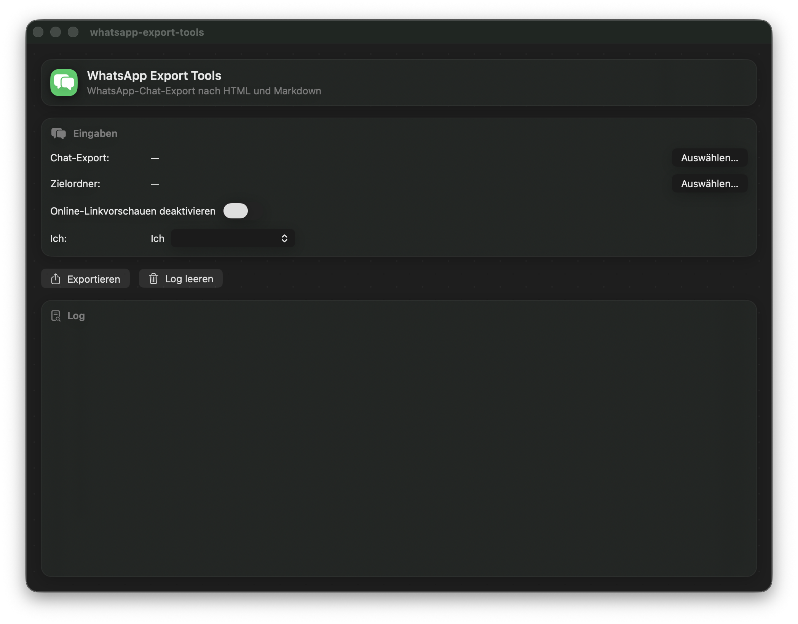

# WhatsApp Export Tools

Convert exported WhatsApp chat logs (`_chat.txt`) into **readable HTML** (WhatsApp-like bubble view) and **Markdown**.

This repository contains:
- a **macOS GUI app (SwiftUI)** for interactive export
- a **Python converter (CLI)** for lightweight / iOS a-Shell workflows

---

## What this does

- Parses common WhatsApp TXT export formats, including:
  - `[DD.MM.YY, HH:MM(:SS)] Name: Text`
  - `DD.MM.YYYY, HH:MM(:SS) - Name: Text`
  - `YYYY-MM-DD HH:MM:SS Name: Text`
- Preserves multi-line messages (lines without a new timestamp are appended to the previous message).
- Produces:
  - **HTML** with day separators, message bubbles, timestamps, optional link previews, and optional inline image attachments
  - **Markdown** grouped by day with timestamps and attachment references

---

## macOS App (SwiftUI)

### Build

1. Open the Xcode project.
2. Select the `whatsapp-export-tools` scheme.
3. Build & Run.

### Use

1. **Chat-Export auswählen**: select the exported WhatsApp TXT file (typically `_chat.txt`).
2. **Zielordner auswählen**: select the folder where the exports should be written.
3. **Ich**: select your own participant name (or choose **Benutzerdefiniert…**).
4. Optional: toggle **Online-Linkvorschauen deaktivieren**.
5. Click **Exportieren**.

### Output

The app writes two files into the chosen target folder:
- `… .html`
- `… .md`

The filenames include a participant summary, the message period, and a timestamp.

### Attachments

If the WhatsApp export folder contains image attachments referenced as `<Anhang: ...>`:
- **HTML** embeds supported image types inline (base64 `data:` URLs).
- **Markdown** links to the filename (keep attachments next to the `.md` file when moving it).

---

## Python (CLI)

The Python script is intended for lightweight usage (including iOS a-Shell). It focuses on Markdown output.

### Files

- `whatsapp_export_to_md.py` — converter script

### Usage (a-Shell / iOS)

1) Put the exported chat file next to the script (example: `_chat.txt`).

2) Run:

    python3 -u whatsapp_export_to_md.py _chat.txt --me "YOUR_NAME"

This produces a timestamped Markdown report grouped by date.

---

## Icon tooling (macOS)

For macOS app icons, an icon helper script is included:
- `make_icons.sh` (uses `sips` + `iconutil`)

It converts a 1024×1024 PNG source icon into an `.iconset` and `.icns`.

---

## Notes

- Keep the WhatsApp export TXT and its attachment files in the same folder during export.
- Some URLs (notably Google services) may show consent/interstitial pages; link preview handling is best-effort.

## Source

Dieses Repository enthält den vollständigen Source Code der macOS-App **whatsapp-export-tools** (SwiftUI).

## License

MIT License – siehe `LICENSE`.

## Trademark notice

“WhatsApp” ist eine Marke von WhatsApp LLC. Dieses Projekt ist nicht mit WhatsApp/Meta verbunden und wird nicht von ihnen unterstützt.