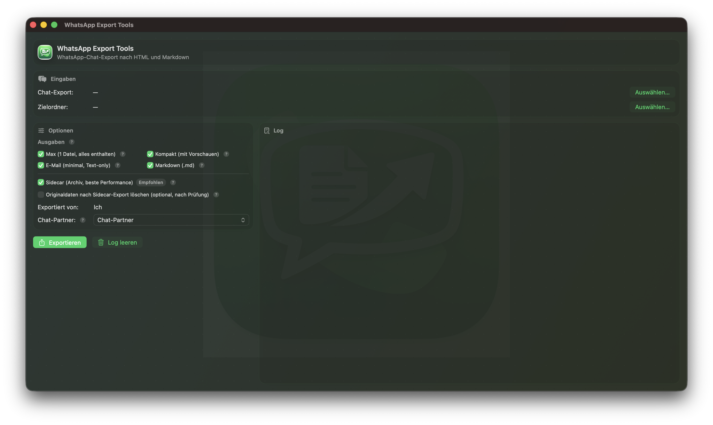
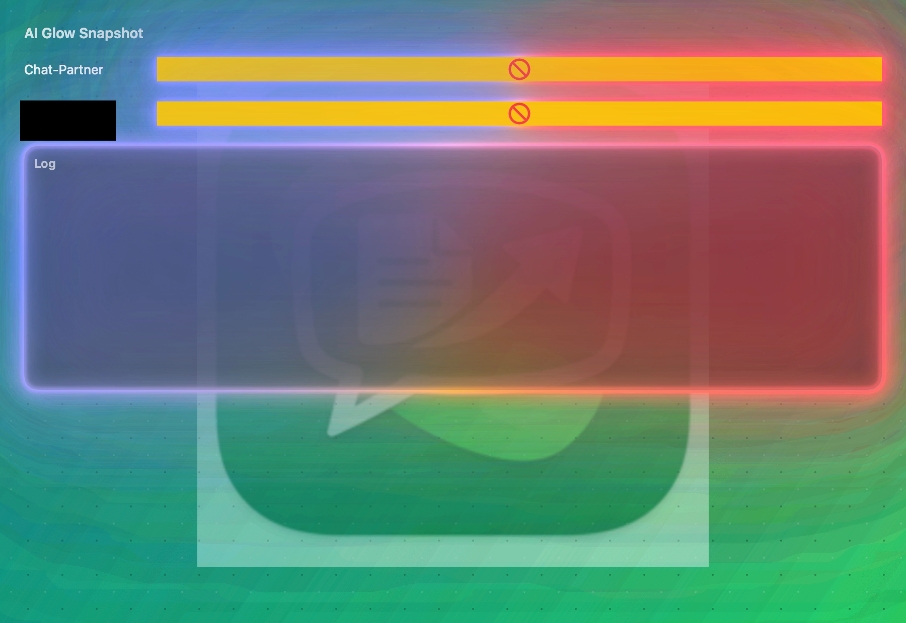
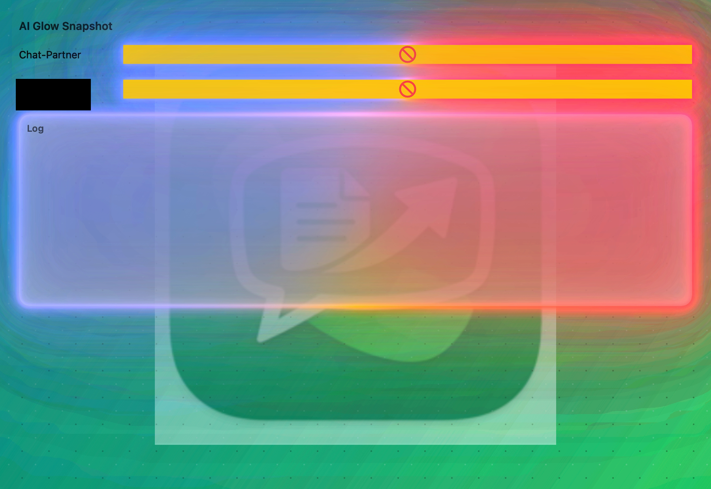

# WhatsApp Export Tools

macOS SwiftUI app for turning exported WhatsApp chat logs (`_chat.txt`) into **readable HTML archives** (WhatsApp-like bubble view) and **Markdown** that open in standard browsers.

---

## Overview

- Parses common WhatsApp TXT export formats (DE/EN variants).
- Preserves multi-line messages and system notices.
- Produces HTML archives and Markdown summaries for long-term reading.

## Features

- WhatsApp-style HTML layout with day separators, timestamps, and link previews.
- Attachment handling with optional embedding, thumbnails, or sidecar references.
- Sidecar export for faster loading and smaller HTML files.
- macOS GUI with export presets and best-effort participant detection.

## Output formats

HTML variants (suffixes are part of the filename):
- `-max` — single HTML file with all media embedded (best offline portability).
- `-mid` — HTML with embedded thumbnails, large media kept external.
- `-min` — text-only HTML (smallest, email-friendly).
- `-sdc` — sidecar HTML that references media files in a folder for fast loading.

Markdown:
- One `.md` file grouped by day with timestamps and attachment references.

## UI: Apple Intelligence-style AI Glow

The macOS UI focuses not only on data conversion, but also on a high-quality **Apple Intelligence-style glow** (Dark + Light) that closely matches the Apple-like AI glow appearance on macOS. Screenshots below show the current default (Siri Pill palette).

## Status (legacy Python)

A legacy Python script remains in the repo for reference/backward compatibility, but it is **not actively developed**. The actively maintained implementation is the macOS SwiftUI app.

- Legacy script: `whatsapp_export_to_md_html.py`

## Build & Run (macOS)

1. Open the Xcode project.
2. Select the `whatsapp-export-tools` scheme.
3. Build & Run.

### Use

1. **Chat-Export auswählen**: select the exported WhatsApp TXT file (typically `_chat.txt`).
2. **Zielordner auswählen**: choose where the exports should be written.
3. **Chat-Partner**: select the counterparty (auto-detected when possible).
4. Choose the desired output variants (HTML + Markdown + Sidecar).
5. Click **Exportieren**.

## Notes

- Keep the WhatsApp export TXT and its attachment files in the same folder during export.
- Some URLs (notably Google services) may show consent/interstitial pages; link preview handling is best-effort.

## License

MIT License – siehe `LICENSE`.

## Trademark notice

“WhatsApp” ist eine Marke von WhatsApp LLC. Dieses Projekt ist nicht mit WhatsApp/Meta verbunden und wird nicht von ihnen unterstützt.
